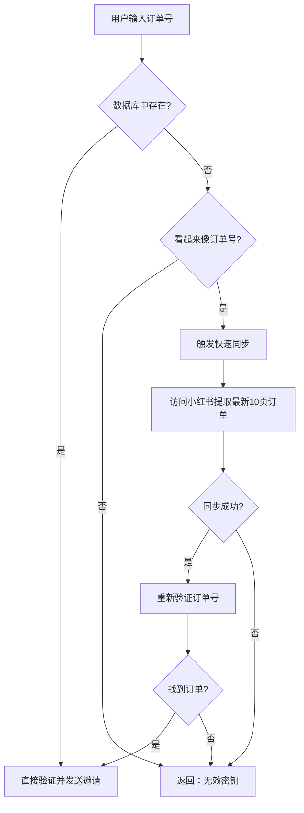

# 实时订单同步方案说明

## 问题
客户下单后需要立即使用邀请码，但定时同步有延迟（6小时/次）。

## 💡 解决方案：按需同步（准实时）

### 工作原理



### 实现细节

#### 1. 触发条件
```python
if not key_info and key_code.startswith('P') and len(key_code) > 10:
    # 看起来像订单号，尝试按需同步
```

#### 2. 快速同步策略
- **只滚动 10 次**（vs 定时任务的 50-100 次）
- **只提取最新订单**（最近下单的订单在前几页）
- **无头模式**，后台运行
- **时长约 30-60 秒**

#### 3. 降级保护
- 同步失败不阻塞用户
- 仍然返回"无效密钥"错误
- 不影响定时任务运行

### 用户体验

#### 场景A：订单已在数据库
```
用户输入订单号 → 0.1秒验证 → 立即发送邀请 ✅
```

#### 场景B：新订单（按需同步）
```
用户输入订单号 → 发现不存在 → 触发同步（30-60秒）→ 
找到订单 → 发送邀请 ✅
```

#### 场景C：无效订单号
```
用户输入错误订单号 → 触发同步 → 仍未找到 → 
返回"无效密钥" ❌
```

### 性能影响

| 指标 | 定时同步 | 按需同步 |
|------|----------|----------|
| 触发频率 | 每6小时 | 按用户输入 |
| 滚动次数 | 50-100次 | 10次 |
| 提取订单 | 全部 | 最新 |
| 耗时 | 1-2分钟 | 30-60秒 |
| 反爬风险 | 低 | 低（用户触发） |

### 最佳实践

#### 推荐配置

1. **定时同步**：6小时/次，全量同步
   - 作用：保持数据库完整
   - 提取所有历史订单

2. **按需同步**：用户输入时触发
   - 作用：实现准实时
   - 只提取最新订单

#### 告知用户

在用户页面添加提示：

```
💡 温馨提示：
- 如果您刚下单，首次输入订单号可能需要等待 30-60 秒
- 系统正在为您实时提取订单信息，请稍候...
```

### 优化建议

#### 方案1：减少滚动延迟
```python
# xhs_order_sync.py 第 195 行
scroll_pause=1  # 从2秒改为1秒
```

#### 方案2：更短的定时间隔
```
定时同步改为 1-2 小时/次
大部分订单会被定时任务提前提取
按需同步作为兜底方案
```

#### 方案3：前端优化
添加加载动画，告知用户正在同步：

```javascript
// 提交表单时
if (orderNumber.startsWith('P')) {
    showLoading('正在验证订单号，首次使用可能需要等待 1 分钟...');
}
```

### 总结

✅ **准实时**：30-60秒延迟，满足大部分场景  
✅ **自动降级**：不影响现有功能  
✅ **按需触发**：不会过度抓取  
✅ **用户友好**：无感知或轻微等待  

这个方案在**实时性**和**稳定性**之间取得了很好的平衡！

---

## 代码修改总结

已修改文件：
- `app_new.py` - `/api/join` 路由添加按需同步逻辑

触发条件：
1. 密钥不存在
2. 以 'P' 开头
3. 长度 > 10

执行策略：
- 快速同步（max_scrolls=10）
- 只提取最新订单
- 失败不阻塞
