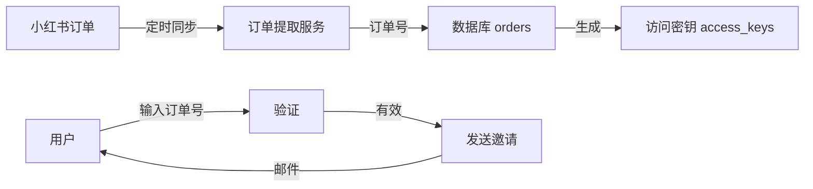

# 小红书自动发货功能 - 升级指南

## 概述

本次升级为**增量更新**，在现有 ChatGPT Team 自动邀请系统基础上新增小红书订单自动发货功能。

**✅ 完全向后兼容**：
- 不修改任何现有功能
- 不影响现有邀请码使用
- 新功能默认禁用，可选启用

---

## 新增功能

### 1. 订单号作为邀请码
- 自动从小红书千帆后台提取订单号
- 订单号自动转换为访问密钥
- 用户输入订单号即可获得 ChatGPT Team 邀请

### 2. Cookie 认证
- 无需手动登录小红书
- 使用 Cookie 自动访问订单页面
- 支持 Cookie 过期检测和提醒

### 3. 定时同步
- 可配置同步间隔（默认 6 小时）
- 自动提取新订单并生成邀请码
- 后台定时任务，无需人工干预

### 4. 管理界面
- 配置 Cookie
- 手动触发同步
- 查看订单列表和统计
- 监控同步状态

---

## 升级步骤

### 方法一：使用升级脚本（推荐）

```bash
# 1. 进入项目目录
cd /path/to/chagpt

# 2. 下载升级脚本
wget https://raw.githubusercontent.com/siyutaosiyutao/chagpt/main/upgrade_xhs.sh

# 3. 执行升级
chmod +x upgrade_xhs.sh
./upgrade_xhs.sh

# 4. 重启服务
sudo systemctl restart chatgpt-team
```

### 方法二：手动升级

```bash
# 1. 备份现有数据
cp chatgpt_team.db chatgpt_team.db.backup

# 2. 拉取最新代码
git pull origin main

# 3. 安装新增依赖
pip3 install selenium>=4.15.0 apscheduler>=3.10.0

# 4. 安装 Chrome 和 ChromeDriver (Ubuntu)
# 安装 Chrome
wget https://dl.google.com/linux/direct/google-chrome-stable_current_amd64.deb
sudo dpkg -i google-chrome-stable_current_amd64.deb
sudo apt-get install -f -y

# 安装 ChromeDriver
# 参考：https://googlechromelabs.github.io/chrome-for-testing/

# 5. 初始化新表
python3 -c "from database import init_db; init_db()"

# 6. 重启服务
sudo systemctl restart chatgpt-team
```

---

## 配置说明

### 1. 获取小红书 Cookie

#### 方法：使用浏览器开发者工具

1. 使用 Chrome 浏览器登录小红书千帆后台
2. 访问订单页面：`https://ark.xiaohongshu.com/app-order/order/query`
3. 按 `F12` 打开开发者工具
4. 切换到 **Network** 标签
5. 刷新页面
6. 找到任意请求，查看 **Request Headers**
7. 复制完整的 **Cookie** 值

#### Cookie 格式

Cookie 需要转换为 JSON 格式，有两种方式：

**方式 1：对象格式（推荐）**
```json
{
  "cookie_name_1": "cookie_value_1",
  "cookie_name_2": "cookie_value_2"
}
```

**方式 2：数组格式**
```json
[
  {"name": "cookie_name_1", "value": "cookie_value_1", "domain": ".xiaohongshu.com"},
  {"name": "cookie_name_2", "value": "cookie_value_2", "domain": ".xiaohongshu.com"}
]
```

### 2. 管理后台配置

1. 访问管理后台：`http://your-server:5002/admin`
2. 登录（使用现有管理员密码）
3. 进入「小红书订单同步」配置页面
4. 粘贴 Cookie（JSON 格式）
5. 设置同步间隔（建议 6 小时）
6. 启用自动同步
7. 点击「立即同步」测试

---

## 数据库变更

本次升级新增以下表，**不修改现有表**：

### `orders` 表
存储从小红书提取的订单

| 字段 | 类型 | 说明 |
|------|------|------|
| id | INTEGER | 主键 |
| order_number | TEXT | 订单号（唯一） |
| key_id | INTEGER | 关联的访问密钥 ID |
| is_used | BOOLEAN | 是否已使用 |
| user_email | TEXT | 使用者邮箱 |
| extracted_at | TIMESTAMP | 提取时间 |
| used_at | TIMESTAMP | 使用时间 |

### `xhs_config` 表
存储小红书配置

| 字段 | 类型 | 说明 |
|------|------|------|
| id | INTEGER | 主键 |
| cookies | TEXT | Cookie（JSON 格式） |
| last_sync_at | TIMESTAMP | 最后同步时间 |
| sync_enabled | BOOLEAN | 是否启用同步 |
| sync_interval_hours | INTEGER | 同步间隔（小时） |
| last_error | TEXT | 最后错误信息 |
| error_count | INTEGER | 错误计数 |

---

## 新增 API 路由

所有新增路由均以 `/api/admin/xhs/` 为前缀，**不影响现有路由**。

| 路由 | 方法 | 说明 |
|------|------|------|
| `/api/admin/xhs/config` | GET | 获取配置 |
| `/api/admin/xhs/config` | POST | 更新配置 |
| `/api/admin/xhs/sync` | POST | 手动触发同步 |
| `/api/admin/xhs/status` | GET | 获取同步状态 |
| `/api/admin/xhs/orders` | GET | 获取订单列表 |

---

## 使用流程

### 管理员端

1. **配置 Cookie**
   - 登录管理后台
   - 配置小红书 Cookie
   - 启用自动同步

2. **监控同步**
   - 查看同步状态
   - 查看订单列表
   - 手动触发同步（如需要）

### 用户端

用户使用流程**不变**：

1. 访问：`http://your-server:5002/`
2. 输入邮箱
3. 输入订单号（作为访问密钥）
4. 点击「加入 Team」
5. 查收邮件并确认

---

## 工作原理



### 详细流程

1. **订单同步**（后台自动）
   - 定时任务每 N 小时运行一次
   - 使用 Cookie 访问小红书订单页面
   - 提取所有订单号（P开头+数字）
   - 自动滚动加载更多订单
   - 保存到数据库并生成访问密钥

2. **用户使用**
   - 用户在小红书下单
   - 获得订单号（如 P779156135993499601）
   - 访问你的服务输入订单号
   - 系统验证订单号并发送邀请

3. **自动发货**
   - 系统自动发送 ChatGPT Team 邀请邮件
   - 用户确认邮件即可加入
   - 订单标记为已使用，不可重复使用

---

## 常见问题

### 1. Cookie 过期怎么办？

**症状**：同步失败，错误信息显示"Cookie已过期"

**解决方法**：
1. 重新登录小红书千帆后台
2. 获取新的 Cookie
3. 在管理后台更新 Cookie

### 2. ChromeDriver 版本不匹配

**症状**：
```
session not created: This version of ChromeDriver only supports Chrome version XX
```

**解决方法**：
```bash
# 查看 Chrome 版本
google-chrome --version

# 下载对应版本的 ChromeDriver
# https://googlechromelabs.github.io/chrome-for-testing/
```

### 3. 订单提取不全

**症状**：实际订单数多于系统提取的订单数

**解决方法**：
- 增加最大滚动次数（修改 `xhs_order_sync.py` 中的 `max_scrolls` 参数）
- 增加滚动等待时间（`scroll_pause` 参数）
- 手动触发多次同步

### 4. 系统资源占用高

**症状**：Chrome 进程占用大量内存

**解决方法**：
- 使用无头模式（已默认启用）
- 降低同步频率（增加 `sync_interval_hours`）
- 限制最大滚动次数

### 5. 与现有功能冲突？

**不会**！本次升级完全向后兼容：
- 现有邀请码功能正常使用
- 订单号只是另一种邀请码形式
- 两种方式可以同时使用

---

## 安全建议

### 1. Cookie 安全

- ✅ Cookie 在数据库中以明文存储，但只有管理员可访问
- ✅ API 返回配置时不包含完整 Cookie
- ⚠️ 建议定期更新 Cookie
- ⚠️ 不要在公共网络配置 Cookie

### 2. 反爬虫

- ✅ 已使用真实浏览器（Selenium）
- ✅ 已禁用 webdriver 检测
- ✅ 使用真实 User-Agent
- ⚠️ 建议同步间隔不少于 6 小时
- ⚠️ 添加随机延迟避免频繁请求

### 3. 数据备份

升级前务必备份：
```bash
cp chatgpt_team.db chatgpt_team.db.backup_$(date +%Y%m%d)
```

---

## 回滚方案

如升级后出现问题，可快速回滚：

```bash
# 1. 停止服务
sudo systemctl stop chatgpt-team

# 2. 恢复代码
cd /path/to/chagpt
git checkout <previous_commit>

# 3. 恢复数据库（可选，不影响现有功能）
cp chatgpt_team.db.backup chatgpt_team.db

# 4. 重启服务
sudo systemctl start chatgpt-team
```

**注意**：回滚不会删除新增的表，但不影响系统运行。

---

## 技术架构

### 新增文件

- `database.py` - 扩展：新增 Order 和 XHSConfig 模型
- `xhs_order_sync.py` - 订单同步服务
- `xhs_scheduler.py` - 定时任务调度器
- `upgrade_xhs.sh` - 升级脚本

### 修改文件

- `app_new.py` - 新增 XHS 相关 API 路由
- `requirements_new.txt` - 新增依赖

### 依赖关系

```
app_new.py
  ├─ database.py (扩展)
  ├─ xhs_scheduler.py (新增)
  └─ xhs_order_sync.py (新增)
       └─ selenium
```

---

## 监控与日志

### 查看服务日志

```bash
# 实时日志
sudo journalctl -u chatgpt-team -f

# 最近 100 行
sudo journalctl -u chatgpt-team -n 100

# 查找错误
sudo journalctl -u chatgpt-team | grep "ERROR\|Exception"
```

### 同步状态监控

通过管理后台查看：
- 最后同步时间
- 同步错误信息
- 订单统计（总数、已用、未用）

---

## 支持与反馈

如遇到问题，请提供以下信息：

1. 错误日志
2. Chrome 和 ChromeDriver 版本
3. Python 版本
4. 操作系统版本
5. 复现步骤

---

## 版本信息

- **版本**：v2.0.0-xhs
- **发布日期**：2025-11-22
- **兼容性**：完全向后兼容 v1.x

---

## 致谢

本功能基于原 ChatGPT Team 自动邀请系统开发，感谢原项目贡献者。
